# Toy Examples for the Block-Causal Transformer

Eight runnable scripts that verify the transformer, tokenizer, dynamics
model, agent heads, and imagination training end-to-end.  Each script
trains a tiny model, asserts that the loss drops, and saves
visualisation plots to the `outputs/` directory.

The full training system (Module 6+7) provides an **online training loop**
(`dreamer4.train`) with YAML configuration, checkpointing, and
TensorBoard logging.

## Prerequisites

```bash
cd dreamer4_pytorch
uv pip install -e .
```

## Running the examples

All commands are run from the `dreamer4_pytorch/` directory.

### 1. Copy Task

```bash
python -m examples.copy_task
```

The model overfits a random target tensor — the simplest check that
gradients flow and the architecture is wired correctly.

**Plots saved:**

| File | Description |
|------|-------------|
| `outputs/copy_task_loss.png` | Training loss (log scale) vs step. Should drop smoothly. |
| `outputs/copy_task_comparison.png` | Side-by-side heatmaps of target, model output, and their difference for one (batch, time) slice. After training the difference should be near zero. |

*MSE loss drops smoothly from ~1.5 to ~0.02 over 500 steps on a log scale, confirming that gradients flow correctly through the architecture.*

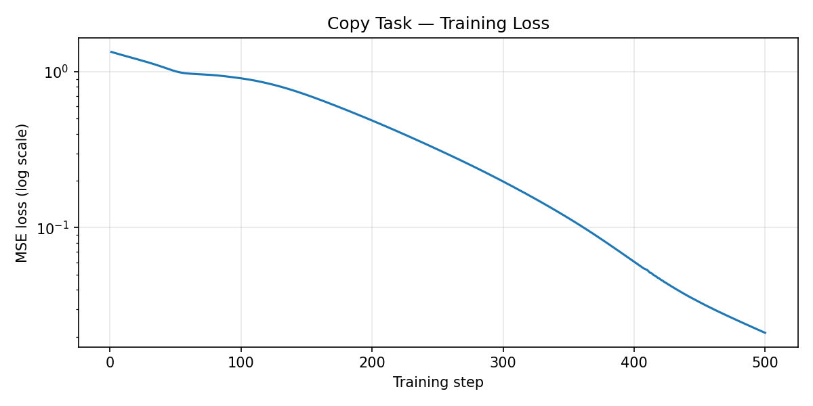

*Three heatmaps for one (batch=0, t=0) slice: the target tensor (left), the model output (center), and their difference (right). The target and output are visually near-identical; the difference map shows only small residual errors (within +-0.4), concentrated in a few spatial tokens.*

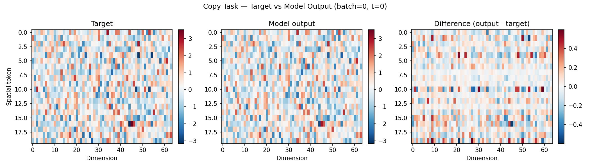

### 2. Pattern Sequence Continuation

```bash
python -m examples.next_token_prediction
```

K distinct pattern vectors cycle in a fixed order (A-B-C-D-A-B-C-D-...).
The model must learn to predict which pattern comes next.  Unlike random
noise, this task has real temporal structure — the model needs **causal
time attention** to detect where it is in the cycle and output the
correct continuation.

**Plots saved:**

| File | Description |
|------|-------------|
| `outputs/pattern_seq_loss.png` | Training loss (log scale) vs step. |
| `outputs/pattern_seq_similarity.png` | Cosine similarity between each prediction and the K pattern templates, with a per-step correctness indicator.  After training the model should pick the right pattern at every step. |

*Loss falls steeply from ~3e-1 to ~3e-5 over 500 steps, indicating the model quickly learns the repeating A-B-C-D cycle.*

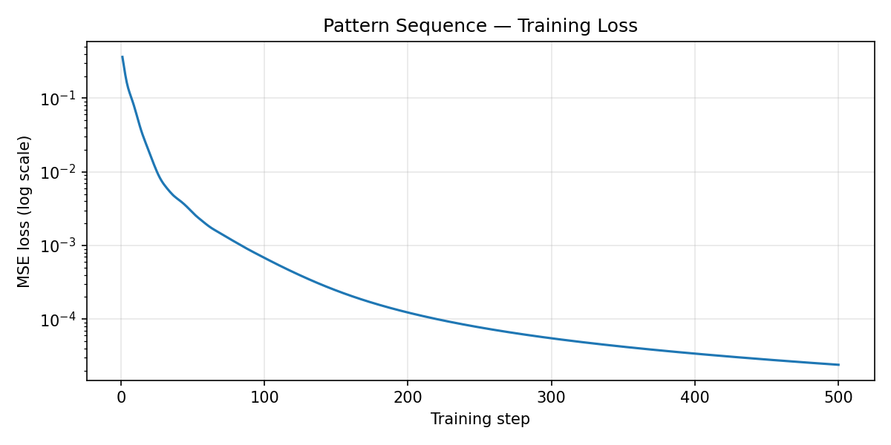

*Left: cosine-similarity heatmap between each prediction and the four pattern templates (A-D). Black boxes mark the correct pattern -- high similarity aligns perfectly with them at every time step. Right: per-step correctness is 100%, confirming the model has learned the full cycle.*

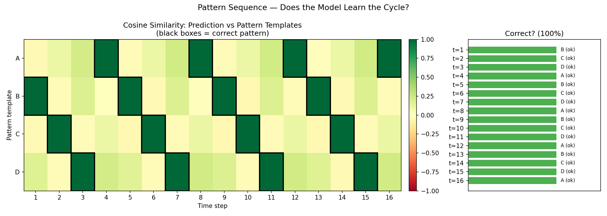

### 3. Sine Wave Prediction

```bash
python -m examples.sine_wave
```

Each spatial position carries a sine wave with a unique frequency and
phase.  The model must learn to predict the next value from the history.

**Plots saved:**

| File | Description |
|------|-------------|
| `outputs/sine_wave_loss.png` | Training loss (log scale) vs step. |
| `outputs/sine_wave_prediction.png` | Ground-truth vs predicted sine values for 4 spatial positions. After training the predicted points should closely follow the true wave. |

*Loss decreases from ~8e-1 to ~5e-4 over 500 steps with periodic spikes (likely from learning-rate warmup restarts or different frequency components locking in). The overall trend is strongly downward.*

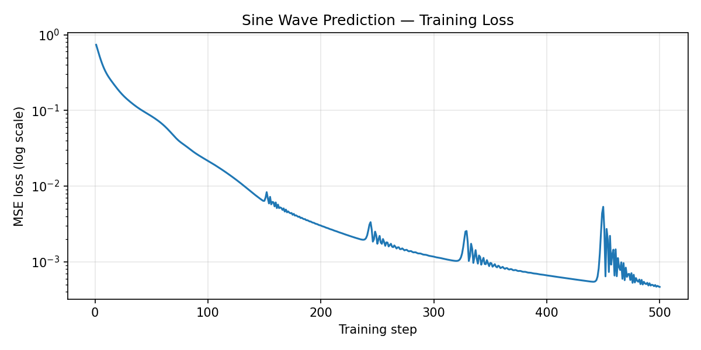

*Four subplots, one per spatial position (s=0, 3, 7, 11), each with a different frequency/phase. Blue circles are ground-truth sine values; orange crosses are model predictions. The predicted points closely track the true wave at all positions, demonstrating the model has learned diverse temporal dynamics from causal context alone.*

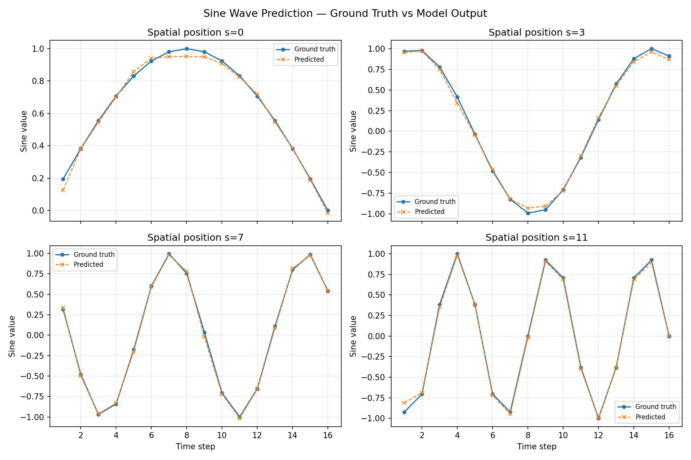

### 4. Bouncing Ball (Image Pipeline)

```bash
python -m examples.bouncing_ball
```

Generates synthetic 32x32 RGB video of a bright ball bouncing inside a
box.  The model predicts the next frame from the history, exercising the
**full image pipeline**: `patchify -> project -> transformer -> project -> unpatchify`.

This is the closest example to what the real tokenizer will do — the model
must learn spatial structure (where is the ball?) and temporal dynamics
(which direction is it moving?) from raw pixels.

**Plots saved:**

| File | Description |
|------|-------------|
| `outputs/bouncing_ball_loss.png` | Training loss (log scale) vs step. |
| `outputs/bouncing_ball_frames.png` | Three rows: ground-truth target frames, model-predicted frames, and the absolute difference.  After training the predictions should closely match. |

*Training loss (blue) drops steadily from ~3e-1 to ~1.5e-4 over 3000 steps. Eval loss (orange) is noisier but follows a clear downward trend, reaching ~5e-4 by the end, showing the model generalises to unseen trajectories.*

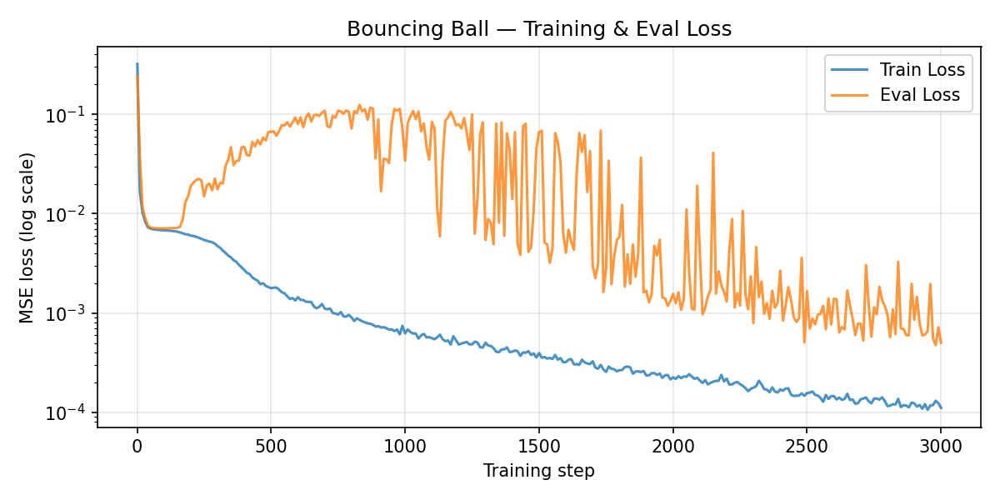

*Four bouncing-ball trajectories (8 frames each). For each trajectory, the TRUE row shows the ground-truth frames and the PRED row (blue border) shows the model's next-frame predictions. The predicted ball positions and shapes closely match the ground truth across all trajectories, confirming the model has learned both spatial appearance and temporal motion from raw 32x32 RGB pixels.*

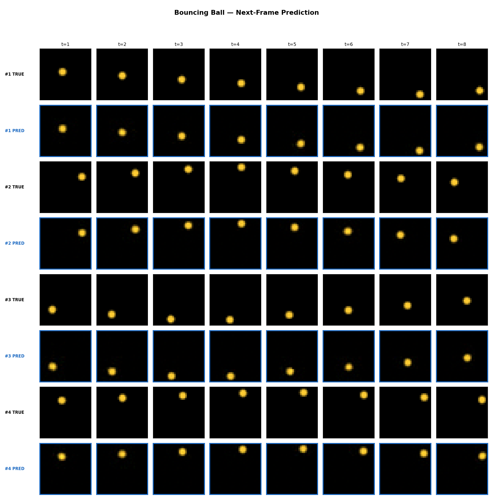

### 5. Tokenizer Reconstruction (Causal Tokenizer)

```bash
python -m examples.tokenizer_recon
```

Trains the full **Causal Tokenizer** (Encoder -> bottleneck -> Decoder)
to reconstruct bouncing-ball video frames using the paper's exact training
objective (Section 3.1, Eq. 5):

    L = L_MSE + 0.2 * L_LPIPS    (both RMS-normalized)

MAE masking with `p ~ U(0, 0.9)` drops random encoder input patches.
MSE is computed on masked patches only (`recon_loss_from_mae`), while
LPIPS is computed on composited full images via `MAECompositedLPIPS`
(the official `lpips` package with MAE-aware patch compositing).
Both loss terms are RMS-normalized before combining (`RMSLossNormalizer`).

**Plots saved:**

| File | Description |
|------|-------------|
| `outputs/tokenizer_recon_loss.png` | Combined loss, MSE, LPIPS, and eval MSE vs step (log scale). |
| `outputs/tokenizer_recon_frames.png` | Ground-truth frames vs tokenizer reconstructions for several eval trajectories. |
| `outputs/tokenizer_recon_mae_pipeline.png` | MAE pipeline: original frames, masked encoder input, and reconstructed output. |

*Four loss curves over 3000 steps. Combined RMS-normalized loss (blue) stabilises around 1.0. MSE on masked patches (orange, dashed) and LPIPS on composited images (green, dotted) both drop by several orders of magnitude. Eval full-image MSE (red) falls to ~2e-5, confirming strong reconstruction quality.*

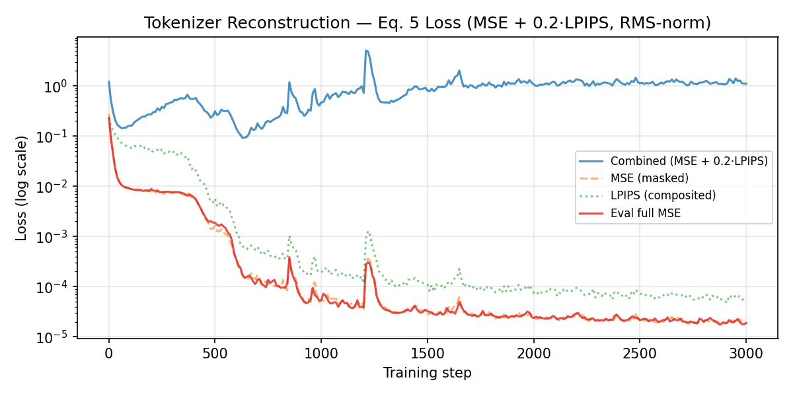

*Four trajectories (8 frames each) comparing ground-truth (TRUE) and tokenizer-decoded (RECON, blue border) frames. The reconstructed ball positions, shapes, and brightness closely match the originals across all time steps, showing the Encoder-Decoder pipeline faithfully reconstructs the input video.*

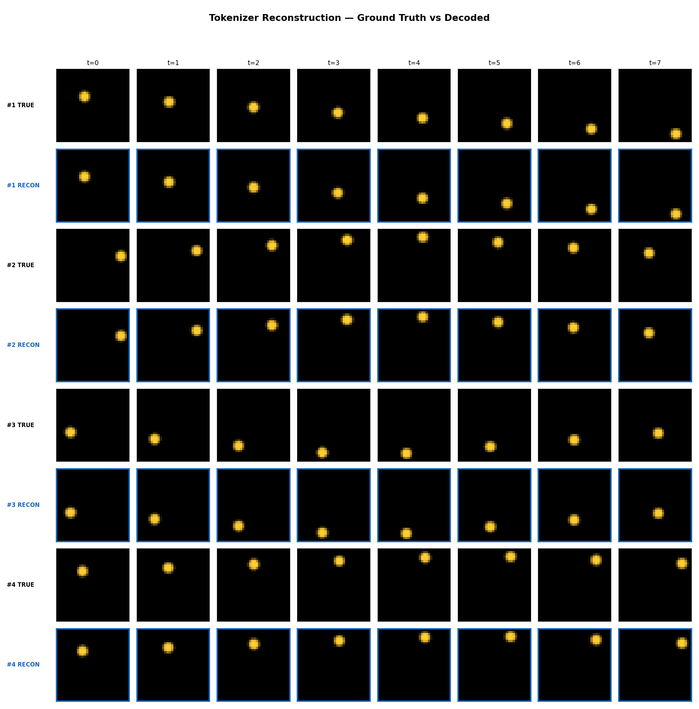

*MAE pipeline visualisation with 34% of patches masked. Top row: original frames. Middle row: encoder input after MAE masking -- several patches are zeroed out, visibly removing parts of the ball. Bottom row: decoder reconstruction, which recovers the full ball despite the missing patches, demonstrating the tokenizer's robustness to partial observations.*

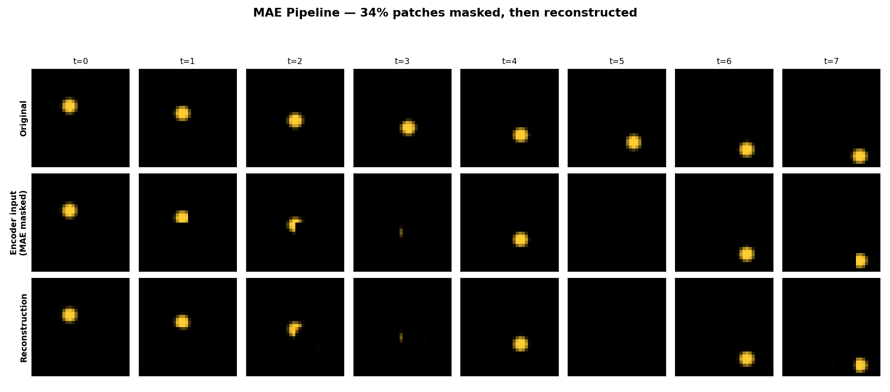

### 6. Dynamics Bouncing Ball (Full Pipeline)

```bash
python -m examples.dynamics_bouncing_ball
```

End-to-end test of the **Shortcut Forcing dynamics pipeline** with a
real causal tokenizer.  Runs three phases:

1. **Tokenizer pretraining** — trains the full Encoder-Decoder with
   the paper's Eq. 5 loss (MSE + 0.2·LPIPS, RMS-normalized) so the
   tokenizer learns a meaningful latent space.
2. **Dynamics training** — freezes the tokenizer, encodes all data
   into the latent space via `pack_bottleneck_to_spatial`, and trains
   the `DynamicsModel` with shortcut forcing (flow matching +
   bootstrap self-consistency).
3. **Sampling & decode** — generates frames autoregressively in
   latent space using K-step Euler denoising, then decodes back to
   pixels through the tokenizer decoder.

**Plots saved:**

| File | Description |
|------|-------------|
| `outputs/dynamics_ball_tok_loss.png` | Tokenizer pretraining loss (combined + eval MSE) vs step. |
| `outputs/dynamics_ball_loss.png` | Dynamics shortcut forcing loss (combined, flow MSE, bootstrap MSE) vs step. |
| `outputs/dynamics_ball_frames.png` | For each trajectory: ground-truth frames (TRUE), tokenizer reconstruction (RECON, grey border), and dynamics-generated frames (GEN). Green border = context frames fed as input; blue border = predicted frames from autoregressive rollout. |

*Tokenizer pretraining: combined RMS-normalized loss (blue) stabilises around 1.0; eval full-image MSE (orange) drops to ~2e-5, indicating near-perfect reconstruction.*

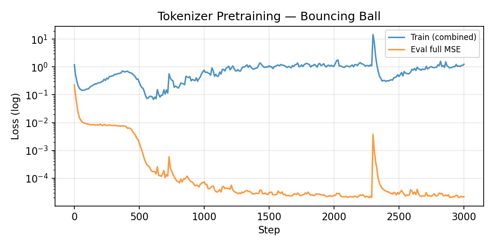

*Dynamics training: combined shortcut forcing loss (blue) drops from ~0.2 to ~0.006 over 3000 steps. Flow MSE (orange, dashed) and bootstrap MSE (green, dotted) both decrease steadily.*

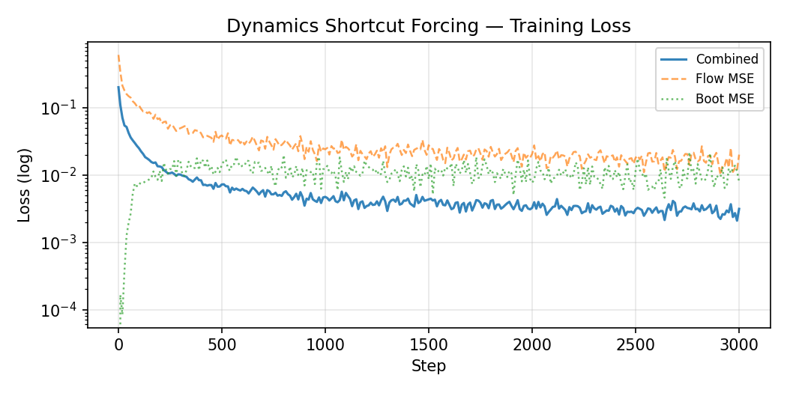

*Four trajectories (8 frames each) with three rows per trajectory. TRUE: ground-truth frames. RECON (grey border): tokenizer-only encode-decode, confirming the latent space is faithful. GEN: dynamics model output decoded through the tokenizer — green-bordered frames are ground-truth context fed as input, blue-bordered frames are autoregressively generated predictions. The generated ball positions track the true trajectory.*

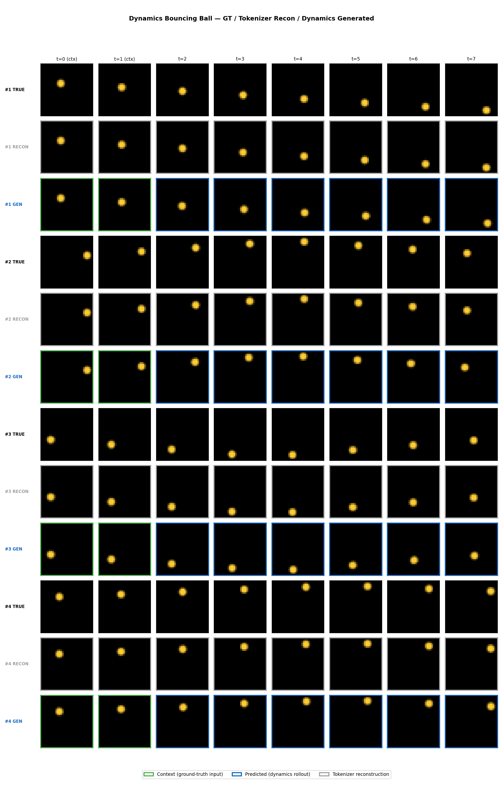

### 7. Full Pipeline (All Modules)

```bash
python -m examples.full_pipeline
```

End-to-end demonstration of the **complete Dreamer 4 pipeline**, exercising
all four implemented modules (Transformer, Tokenizer, Dynamics, Agent Heads)
on a bouncing-ball task with rewards.  Mirrors the paper's three training
phases:

1. **Phase 1a — Tokenizer pretraining** — trains the causal Encoder-Decoder
   with MSE + 0.2·LPIPS (Eq. 5).
2. **Phase 1b — Dynamics pretraining** — freezes the tokenizer, encodes
   data to latent space, trains `DynamicsModel` with `n_agent=0` via
   shortcut forcing (flow matching + bootstrap self-consistency).
3. **Phase 2 — Agent finetuning** — creates a new `DynamicsModel` with
   `n_agent=1` (space_mode `wm_agent`), copies pretrained weights, and
   jointly trains dynamics + `PolicyHead` (behavior cloning with MTP) +
   `RewardHead` (SymExpTwoHot with MTP) using `TaskEncoder` for agent
   token inputs.
4. **Phase 3 — Imagination training** — freezes the world model; uses
   dynamics forward passes with flow-schedule corruption on training data
   to extract agent embeddings; trains `ValueHead` with TD(lambda) targets
   and finetunes the policy via a bounded reinforce objective (PMPO-style
   with clamped log-probabilities).

The environment produces a reward signal (+1 when the ball is in the right
half of the frame, 0 otherwise), giving the agent a meaningful signal to
learn from.

**Plots saved:**

| File | Description |
|------|-------------|
| `outputs/full_pipeline_tok_loss.png` | Tokenizer pretraining loss (combined + eval MSE) vs step. |
| `outputs/full_pipeline_dyn_loss.png` | Dynamics shortcut forcing loss (combined, flow, bootstrap) vs step. |
| `outputs/full_pipeline_agent_loss.png` | Phase 2 losses: dynamics, BC (policy), and reward prediction — all three converge. |
| `outputs/full_pipeline_imagination_loss.png` | Phase 3 losses: PMPO policy loss (bounded) and TD-lambda value loss (dual Y-axes). |
| `outputs/full_pipeline_frames.png` | Combined visualization (see below). |

*Phase 2 agent finetuning: dynamics loss (blue) stabilises, BC policy loss (orange) drops steadily as the policy learns to imitate the ball's velocity, and reward prediction loss (green) converges to a low level.*

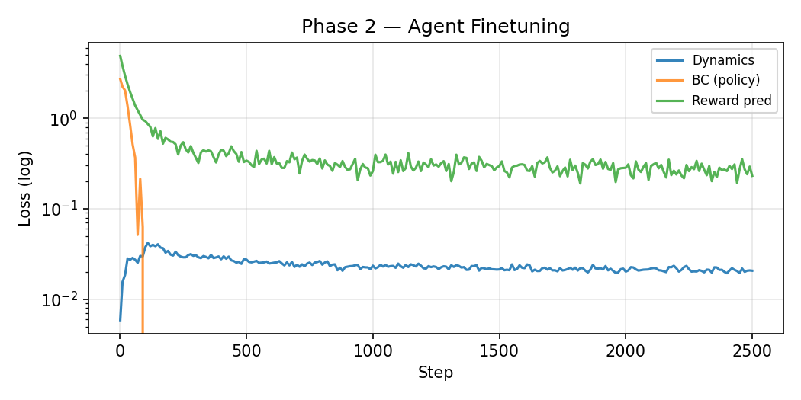

*Phase 3 imagination: PMPO policy loss (blue, left axis) oscillates in a bounded range as the policy trades off increasing log-probability under positive advantages vs decreasing it under negative ones. Value loss (orange, right axis) converges, indicating the value head learns the TD-lambda targets.*

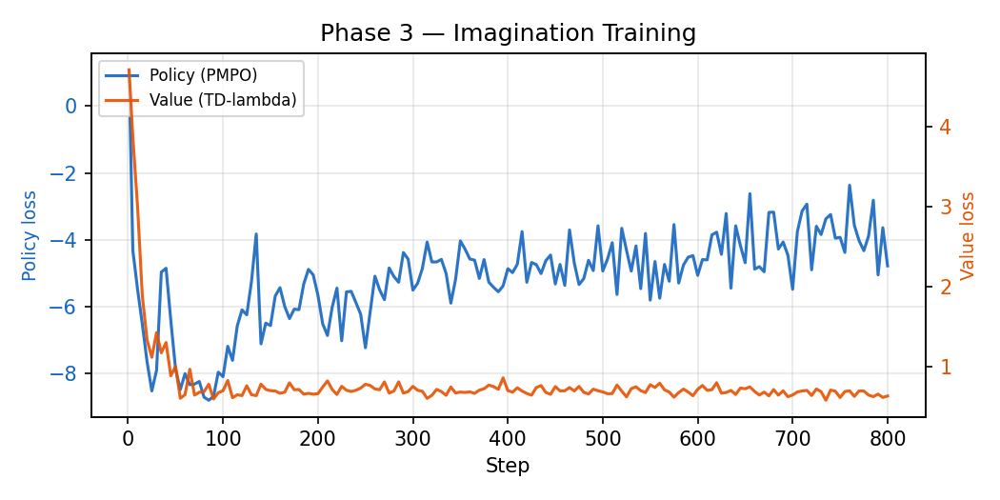

**Combined visualization** (`full_pipeline_frames.png`) — for each of the
four evaluation trajectories, five rows are displayed:

| Row | Left label | Description |
|-----|-----------|-------------|
| 1 | **#N GT** | Ground-truth video frames (no border). |
| 2 | **#N Dyn** | Dynamics-only predictions from the pretrained model (`n_agent=0`). Green border = context frames (GT input); orange border = autoregressively predicted frames. |
| 3 | **#N Agent** | Agent-conditioned predictions from the finetuned model (`n_agent=1`). Green border = context; blue border = predicted. |
| 4 | **#N R** | Reward bar chart comparing GT rewards (green bars) to predicted rewards (blue bars) at each predicted timestep. |
| 5 | **#N V** | Value curve: predicted state value (purple circles, solid line) plotted alongside the GT lambda-return target (green squares, dashed line). |

A bottom legend explains all border colors and line styles.

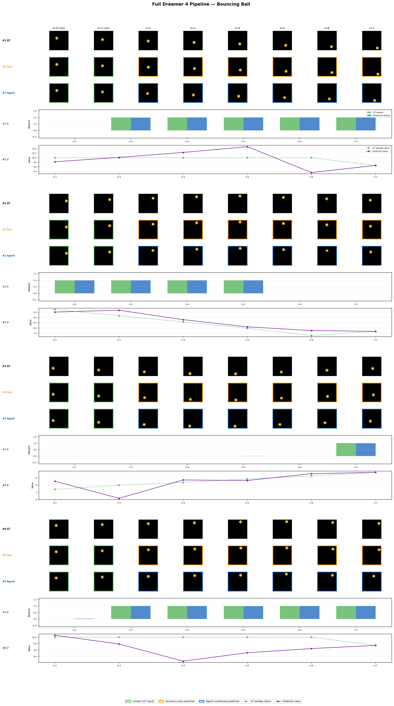

### 8. DMControl Imagination Training (Full Pipeline)

```bash
MUJOCO_GL=egl python -m examples.dmcontrol_imagination
```

End-to-end demonstration of the **complete Dreamer 4 pipeline** on a real
visual RL task (cartpole-swingup from DMControl).  Uses the new Module 5
imagination training infrastructure (`dreamer4.imagination`,
`dreamer4.envs`, `dreamer4.replay`) to run all paper phases on 64x64
pixel observations with continuous actions:

1. **Phase 0 — Data collection** — collects random-policy episodes into a
   replay buffer (~40 episodes, ~20k transitions).
2. **Phase 1a — Tokenizer pretraining** — trains the causal Encoder-Decoder
   on video subsequences from the replay buffer with MSE + 0.2 LPIPS.
3. **Phase 1b — Dynamics pretraining** — freezes the tokenizer, encodes
   replay data to latent space, trains the `DynamicsModel` with shortcut
   forcing.
4. **Phase 2 — Agent finetuning** — creates a dynamics model with agent
   tokens, copies pretrained weights, and jointly trains dynamics +
   `PolicyHead` (behavior cloning) + `RewardHead` (reward prediction).
5. **Phase 3 — Imagination training** — freezes the world model; uses
   `imagine_rollout()` to generate trajectories inside the learned world
   model with the policy sampling actions; trains the `ValueHead` with
   TD(lambda) and finetunes the policy via `imagination_training_step()`
   using PMPO with KL regularization to a behavioral prior.
6. **Evaluation** — runs the learned policy in the real environment and
   reports episode returns.

Uses tiny model sizes (~300K-2.7M parameters) and completes in ~4 minutes
on a single GPU.

**Requires:** `dm_control`, `mujoco`, `gymnasium` (all pre-installed).
Set `MUJOCO_GL=egl` for headless rendering.

**Plots saved:**

| File | Description |
|------|-------------|
| `outputs/dmc_tok_loss.png` | Tokenizer pretraining loss vs step. |
| `outputs/dmc_dyn_loss.png` | Dynamics shortcut forcing loss vs step. |
| `outputs/dmc_agent_loss.png` | Phase 2 losses: dynamics, BC, reward prediction. |
| `outputs/dmc_imagination_loss.png` | Phase 3: PMPO policy loss + TD-lambda value loss (dual Y-axes). |
| `outputs/dmc_frames.png` | Visualization comparing GT frames, tokenizer reconstructions, and dynamics-generated frames for cartpole-swingup trajectories. Green border = context; blue = predicted. |

### 9. Online Training Loop (Module 6)

Module 6 provides the `Dreamer4Agent` class and `online_training_loop`
function in `dreamer4/train.py`.  These combine all previously implemented
components into a DreamerV3-style training pipeline:

```python
from dreamer4.train import Dreamer4Agent, TrainConfig, online_training_loop
from dreamer4.envs import DMControlEnv, TimeLimitWrapper

config = TrainConfig(
    domain="cartpole",
    task="swingup",
    total_steps=100_000,
    n_envs=4,
)

agent = Dreamer4Agent(config)

# Attach a pretrained tokenizer (from Phase 1a)
# agent.set_tokenizer(pretrained_tok)

env_fns = [
    lambda: TimeLimitWrapper(
        DMControlEnv(config.domain, config.task, size=config.image_size),
        max_steps=config.time_limit,
    )
    for _ in range(config.n_envs)
]

history = online_training_loop(agent, env_fns, config)
```

The loop follows the standard Dreamer schedule:

1. **Prefill** — collect random-action episodes into the replay buffer.
2. **Collect** — run the learned policy in parallel environments.
3. **Train WM** — tokenizer reconstruction + shortcut forcing + agent
   head behavior cloning and reward prediction on replay data.
4. **Imagine** — unroll the world model with the policy, compute
   TD(lambda) returns, update the value head and policy via PMPO.

**Module 6 components:**

| File | Description |
|------|-------------|
| `dreamer4/envs.py` | `DMControlEnv`, `MultiCameraEnv`, and composable wrappers (`ActionRepeatWrapper`, `NormalizeActionWrapper`, `TimeLimitWrapper`). |
| `dreamer4/driver.py` | `Driver` class for parallel environment collection with `ThreadPoolExecutor`. |
| `dreamer4/replay.py` | Episode-based `ReplayBuffer` with O(1) deque eviction and prefill gating. |
| `dreamer4/train.py` | `Dreamer4Agent` orchestrator and `online_training_loop`. |

### 10. Configuration, Logging, and Checkpointing (Module 7)

Module 7 adds a YAML-based configuration system, TensorBoard logging,
and checkpoint save/load/resume support.

#### YAML Config

```python
from dreamer4.config import TrainConfig, load_config, save_config

# Load from preset
cfg = load_config("config/dmcontrol.yaml")

# Override specific fields
cfg = load_config("config/defaults.yaml", overrides={"domain": "walker", "task": "walk"})

# Save config for reproducibility
save_config(cfg, "runs/exp01/config.yaml")
```

**Preset files in `config/`:**

| File | Description |
|------|-------------|
| `config/defaults.yaml` | All default values matching `TrainConfig`. |
| `config/dmcontrol.yaml` | DMControl-specific overrides (4 envs, 500K steps). |
| `config/debug.yaml` | Tiny model for fast debugging (CPU, 500 steps). |

#### TensorBoard Logging

All metrics are written to TensorBoard. View with:

```bash
tensorboard --logdir runs/exp01/tb
```

Metrics are automatically grouped by prefix:
- `wm/` — world model (dynamics_loss, tokenizer_loss)
- `agent/` — agent heads (bc_loss, reward_pred_loss)
- `imagine/` — imagination (policy_loss, value_loss)
- `env/` — environment (episode_return, env_steps)

#### Checkpointing

```python
from dreamer4.checkpoint import save_checkpoint, load_checkpoint

# Save
save_checkpoint("ckpt/step_1000.pt", agent, optimizers,
                train_step=1000, env_steps=50000, config=cfg)

# Load and resume
meta = load_checkpoint("ckpt/step_1000.pt", agent, optimizers)
# meta["train_step"] == 1000, meta["env_steps"] == 50000
```

The training loop auto-saves periodic checkpoints and a final checkpoint:

```python
online_training_loop(
    agent, env_fns, cfg,
    tokenizer=tok,
    log_dir="runs/exp01/tb",
    checkpoint_dir="runs/exp01/ckpts",
    resume_from="runs/exp01/ckpts/final.pt",  # optional
)
```

#### Module 7 Components

| File | Description |
|------|-------------|
| `dreamer4/config.py` | YAML config loading/saving, validation, `TrainConfig` dataclass. |
| `dreamer4/checkpoint.py` | `save_checkpoint`, `load_checkpoint`, `AutoCheckpoint`. |
| `metrics_logging.py` (repo root) | `MetricsLogger` (TensorBoard), `setup_logging`. Not named `logging.py` to avoid shadowing the stdlib. |
| `config/defaults.yaml` | Default config preset. |
| `config/dmcontrol.yaml` | DMControl preset. |
| `config/debug.yaml` | Debug preset (tiny model). |

## Output directory

All plots are saved to `examples/outputs/`.  The directory is created
automatically on the first run.  These files are not tracked by version
control.
